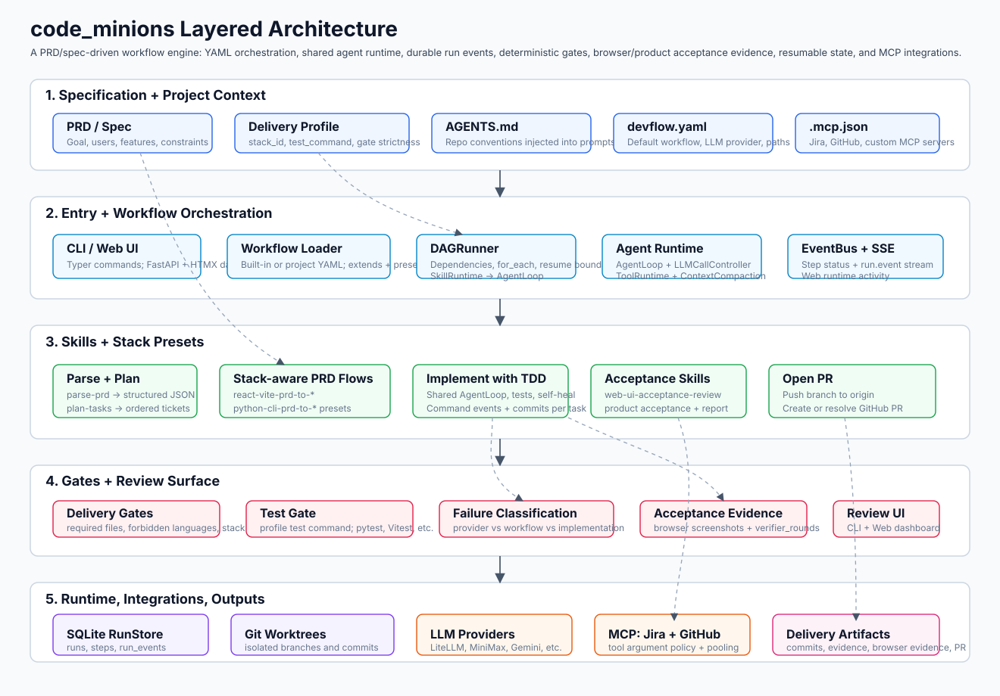

# code_minions

> An AI-native software delivery workflow engine: from PRD to implementation,
> verification, and git PR/MR.

📚 **Docs:** [quickstart](docs/quickstart.md) · [skills](docs/skills.md) · [workflows](docs/workflows.md)

🇨🇳 **中文**：[README_zh.md](README_zh.md)

## What It Is

`code_minions` is an AI-native software delivery workflow engine for turning a
PRD into shipped code. It connects the full engineering loop: product
requirements, task planning, Jira-style work tracking, AI implementation,
test-driven verification, code review, delivery reports, and GitHub PR / GitLab
MR creation.

Instead of treating an AI coding agent as a one-off chat session,
`code_minions` runs the development process as a resumable, auditable workflow.
Each run has declared inputs, isolated workspaces, structured state, explicit
gates, and reproducible artifacts, so long-running autonomous work can be
inspected, resumed, and landed like normal engineering work.

The core product model:

- **End-to-end PRD-to-PR automation:** built-in workflows can parse a PRD,
  derive implementation tasks, create external tickets, generate commits,
  verify the result, compile a report, and open the final PR/MR.
- **Model-provider agnostic:** LLM calls go through LiteLLM, so the same
  workflows can run on most mainstream model providers by changing
  `devflow.yaml` and exporting the matching API key.
- **External systems via MCP:** Jira, GitHub, and similar products are connected
  through `.mcp.json`, letting workflow steps operate across the tools your team
  already uses.
- **Composable skills:** each workflow step is a skill. Skills use Claude-style
  `SKILL.md` frontmatter, optional local tool capability limits, and optional
  deterministic `entrypoint-script` code.
- **Project-aware execution:** `AGENTS.md` is injected into LLM-driven skill
  prompts so implementation follows your repo conventions, stack rules, and
  delivery contract.

## Architecture

[](docs/assets/architecture-en.svg)

## Install

`code-minions` is not published on PyPI yet. Install from source:

```bash
git clone https://github.com/malu/code-minions.git
cd code-minions
pip install -e .
```

Requires Python 3.11+.

If you are contributing to `code_minions` itself and need local test/lint
tools, install the development extras:

```bash
pip install -e '.[dev]'
```

## Two-Minute Smoke Test

```bash
cd your-project
code-minions init .
code-minions run hello-world --input name=world
code-minions list-runs
code-minions status <run-id>
```

`hello-world` needs no LLM key, no MCP server, and no git repo. It verifies
project initialization, run storage, scratch workspace creation, and
deterministic skill execution. Code-changing PRD workflows still require a
local git repo with at least one commit.

For PRD workflows, include a `Delivery Contract` / `delivery_profile` in the
PRD so the run knows the required product shape, language, build system, test
command, required files, and forbidden product languages. See
[PRD template](docs/prd-template.md) for Swift macOS, Go service, Python CLI,
and React examples.

## Model Providers

`code_minions` is designed to be model-provider agnostic. It uses LiteLLM under
the hood, so OpenAI, Anthropic, Gemini, DeepSeek, MiniMax, Ollama, and other
LiteLLM-compatible providers share the same workflow engine. In the common
cloud-provider case, setup is just:

1. Add provider/model entries to `devflow.yaml`.
2. Export the referenced API key environment variables.
3. Set `llm.default` to the fallback provider, and optionally set
   `llm.roles` for role-specific providers.

Example:

```yaml
llm:
  default: minimax
  roles:
    implementer: minimax
    reviewer: anthropic
  providers:
    openai:
      model: gpt-5.5
      api_key_env: OPENAI_API_KEY
    anthropic:
      model: claude-sonnet-4-6
      api_key_env: ANTHROPIC_API_KEY
    gemini:
      model: gemini-3.1-pro-preview
      api_key_env: GEMINI_API_KEY
    minimax:
      model: MiniMax-M2.7
      api_key_env: MINIMAX_API_KEY
      api_base: https://api.minimaxi.com/v1
```

`llm.roles` is optional. When present, a skill whose `SKILL.md` declares a
matching `role` uses that provider instead of `llm.default`. The built-in
implementation loop declares `role: implementer`, and `ai-code-review` declares
`role: reviewer`, so implementation and AI review calls can run on different
models/providers. Each role provider must also be listed under `llm.providers`
and have its API key available. Deterministic product/browser acceptance skills
do not use an LLM provider.

For provider details, Jira/GitHub MCP examples, and full PRD-to-PR
prerequisites, follow the [quickstart](docs/quickstart.md).

### Runtime Observability

Each run writes structured runtime events to `.devflow/runs.db` in the
`run_events` table. Long LLM/tool/test operations now record started,
finished, and failed events with provider/model, role, timeout, attempt,
duration, compact output sizes, and failure classification. Large prompts and
raw tool outputs are not stored in the event payload; events keep sizes,
metadata, classifications, and artifact paths.

Useful environment knobs:

- `CODE_MINIONS_LLM_TIMEOUT_SECONDS` controls the provider request timeout.
- `CODE_MINIONS_CONTEXT_BUDGET_CHARS` controls when long agent conversations
  are compacted before the next model call.

## Built-In Workflows

| Workflow | Use It When | Minimal Command |
|---|---|---|
| `hello-world` | You want to verify installation and runtime basics without AI or external services. | `code-minions run hello-world --input name=world` |
| `summarize-file` | You want a small AI smoke test: deterministic file read, then one LLM call for a summary. | `code-minions run summarize-file --input file=./README.md` |
| `react-vite-prd-to-commit` | You want the same local commit flow, but with React + TypeScript + Vite rules pinned up front. | `code-minions run react-vite-prd-to-commit --input prd=./my-prd.md` |
| `swift-xcodegen-prd-to-commit` | You want the same local commit flow, but with Swift + SwiftUI + XcodeGen rules pinned up front. | `code-minions run swift-xcodegen-prd-to-commit --input prd=./my-prd.md` |
| `go-service-prd-to-commit` | You want the same local commit flow, but with Go service rules pinned up front. | `code-minions run go-service-prd-to-commit --input prd=./my-prd.md` |
| `python-cli-prd-to-commit` | You want the same local commit flow, but with Python CLI rules pinned up front. | `code-minions run python-cli-prd-to-commit --input prd=./my-prd.md` |
| `python-web-prd-to-commit` | You want the local commit flow for Python FastAPI services, with a dedicated planner that keeps small APIs in one canonical app task. | `code-minions run python-web-prd-to-commit --input prd=./my-prd.md` |
| `react-vite-prd-to-pr` | You want the full PR path with React + TypeScript + Vite rules pinned up front. | `code-minions run react-vite-prd-to-pr --input prd=./my-prd.md --input project_key=ABC --input epic_title="Feature"` |
| `python-cli-prd-to-pr` | You want the full PR path with Python CLI rules pinned up front. | `code-minions run python-cli-prd-to-pr --input prd=./my-prd.md --input project_key=ABC --input epic_title="Feature"` |
| `python-web-prd-to-pr` | You want the full PR path for Python FastAPI services with canonical app/package gates. | `code-minions run python-web-prd-to-pr --input prd=./my-prd.md --input project_key=ABC --input epic_title="Feature"` |

For PRD runs, prefer the workflow that names your stack. Stack-specific
workflows pin delivery rules before parsing and planning, so they are more
predictable and do not rely on runtime stack inference. `python-web-prd-to-commit`
is more than a thin alias: it uses a FastAPI-specific planner that keeps small
services in one canonical `src/<package>/app.py` implementation task.

For PRD-to-PR runs, prefer a stack-specific workflow when one matches the
project. These use the same Jira/GitHub delivery path while pinning the stack
before parsing and planning:

```bash
code-minions run python-cli-prd-to-pr \
  --input prd=./my-prd.md \
  --input project_key=ABC \
  --input epic_title="Text count CLI"

code-minions run react-vite-prd-to-pr \
  --input prd=./my-prd.md \
  --input project_key=ABC \
  --input epic_title="Kanban web app"

code-minions run python-web-prd-to-pr \
  --input prd=./my-prd.md \
  --input project_key=ABC \
  --input epic_title="Inventory API"
```

After a run:

```bash
code-minions status <run-id>
ls .devflow/runs/<run-id>/
code-minions resume <run-id>
```

PRD-to-PR workflows only open the final pull request when product acceptance
passes. If acceptance fails, the PR step is skipped and the run is marked
`completed_with_issues`; inspect the run worktree and `report.md` before
resuming or making manual fixes.

PRD workflows that deliver a Web UI run browser acceptance before product
acceptance. Supported stacks produce `.devflow/browser-evidence/` artifacts
such as desktop/mobile screenshots, console diagnostics, layout metrics, and
scenario results. Generated unit tests and browser/product acceptance remain
separate quality signals in the final report.

For code-changing runs, the engine creates a new branch named
`code-minions/<run-id>` from the project repository's current `HEAD`, not
necessarily from the remote default branch. Implementation commits live on that
branch inside `.devflow/runs/<run-id>/worktree`. `*-prd-to-commit` workflows do
not merge the branch back into your checked-out project automatically. After
reviewing the worktree and `report.md`, merge the branch back into your project
branch:

```bash
git switch main
git merge --no-ff code-minions/<run-id>
git worktree remove .devflow/runs/<run-id>/worktree
git branch -d code-minions/<run-id>
```

`*-prd-to-pr` workflows use the same run branch and worktree, then push that
branch to `origin` and open a PR when product acceptance passes; they do not
merge the PR.

See [quickstart](docs/quickstart.md#land-worktree-results) for review,
conflict, and cleanup notes.

`code-minions run` prints live step progress while it is attached. For long
workflows, open another terminal and use `status` or `list-runs` to inspect the
same run.

See [workflows](docs/workflows.md) for workflow YAML details and [skills](docs/skills.md)
for custom skill authoring.

## Web Dashboard

```bash
code-minions web
```

Open `http://127.0.0.1:8080/` to view runs, inspect step status, start workflows
from a form, and receive live SSE updates for Web-started runs.

Current limits:

- localhost-only by default; remote binds require
  `code-minions web --host 0.0.0.0 --enable-remote --auth-token <token>`
- CLI-started runs appear in the Web UI but do not stream live across processes
- Web `Cancel` is advisory and Web `Resume` is currently synchronous

## How It Works

1. `code-minions run [workflow]` loads workflow YAML from the configured `workflow.search_paths` or built-ins.
2. If `[workflow]` is omitted, `devflow.yaml -> workflow.default` is used; an explicit CLI workflow always overrides it.
3. The engine creates the workflow's workspace: a scratch directory, the project root in read-only mode, or `.devflow/runs/<run-id>/worktree` on a branch like `code-minions/<run-id>`.
4. DAGRunner executes each step in dependency order.
5. Deterministic skills run their declared `entrypoint-script`; LLM skills read `SKILL.md` + `AGENTS.md` and call allowed tools within any declared `tool-capabilities`.
6. Run state is stored in `.devflow/runs.db`, enabling status inspection and resume. Successful runs also append deterministic local facts to `.devflow/memory.md`, which future LLM prompts can read alongside `AGENTS.md`.

## Built-In Skills

`hello-world`, `summarize-file`, `parse-prd`, `plan-tasks`,
`create-jira-tickets`, `implement-with-tdd`, `ai-code-review`,
`compile-report`, and `open-github-pr`.

Inspect them locally:

```bash
code-minions skill list
code-minions skill info parse-prd
code-minions skill test
```

## License

MIT.
