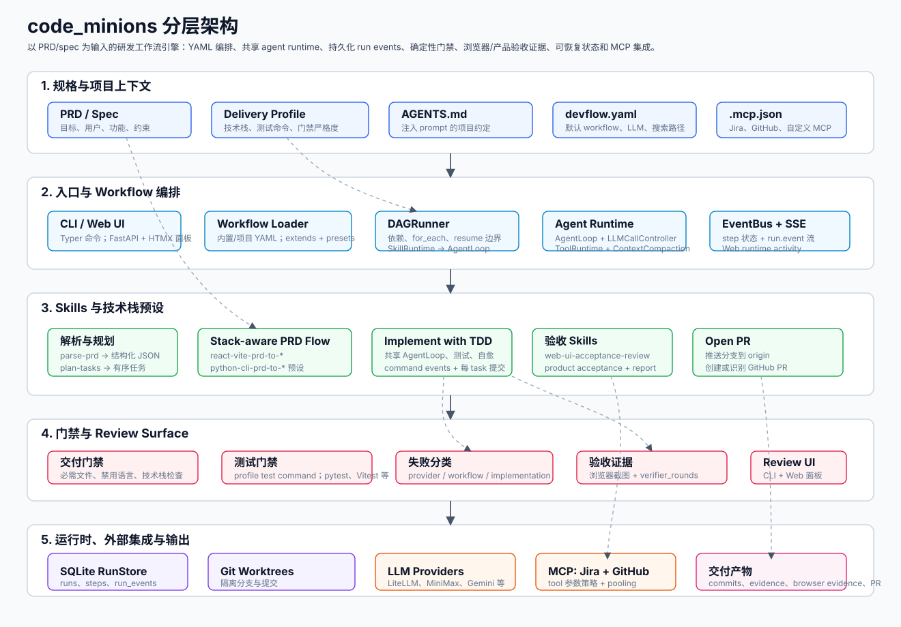

# code_minions

> AI 原生的软件研发交付工作流引擎：从 PRD 到实现、验证，再到 git PR/MR。

📚 **文档**：[快速上手](docs/quickstart.md) · [skills 指南](docs/skills.md) · [workflow 指南](docs/workflows.md)

🇬🇧 **English**：[README.md](README.md)

## 这是什么

`code_minions` 是一个 AI 原生的软件研发交付工作流引擎，用来把 PRD 真正推进到
可合并的代码变更。它打通从产品需求、任务拆解、Jira 式协同、AI 实现、TDD 验证、
代码审查、交付报告，到 GitHub PR / GitLab MR 创建的完整闭环。

它不是一次性的 AI 聊天编程工具，而是把软件研发过程建模成可恢复、可审计、可落地的
自动化 workflow。每一次 run 都有明确输入、隔离 workspace、结构化状态、显式质量门禁
和可追踪产物，让长时间运行的自主研发任务可以被检查、resume，并最终像正常工程变更一样
进入 git 交付链路。

核心模型：

- **端到端 PRD-to-PR 自动化**：内置 workflow 可以解析 PRD、拆解实现任务、创建外部
  ticket、生成 commit、验证结果、汇总 report，并打开最终 PR/MR。
- **不绑定具体大模型**：LLM 调用统一走 LiteLLM；只要在 `devflow.yaml`
  里切换 provider/model，并导出对应 API key，同一套 workflow 就能跑在大多数主流模型上。
- **外部系统走 MCP**：Jira、GitHub 等产品通过 `.mcp.json` 接入，让 workflow step
  可以跨团队现有工具链执行。
- **skill 可装配**：每个 workflow step 都是一个 skill。skill 使用 Claude 风格的
  `SKILL.md` frontmatter，也可以声明确定性的 `entrypoint-script`。
- **理解项目约定并按约束交付**：LLM skill prompt 会注入 `AGENTS.md`，让实现过程遵守
  当前 repo 的工程约定、技术栈规则和交付契约。

## 架构图

[](docs/assets/architecture-zh.svg)

## 安装

`code-minions` 还没有发布到 PyPI。当前需要从源码安装：

```bash
git clone https://github.com/malu/code-minions.git
cd code-minions
pip install -e .
```

要求 Python 3.11+。

如果你要开发 `code_minions` 本仓库并在本地运行测试或 lint，请安装开发依赖：

```bash
pip install -e '.[dev]'
```

## 两分钟烟雾测试

```bash
cd your-project
code-minions init .
code-minions run hello-world --input name=world
code-minions list-runs
code-minions status <run-id>
```

`hello-world` 不需要 LLM key、MCP server 或 git repo。它用来验证初始化、run 存储、
scratch workspace 创建和确定性 skill 执行是否正常。会修改代码的 PRD workflow
仍然要求本地 git repo，且至少已有一个 commit。

PRD workflow 建议在 PRD 中写清 `Delivery Contract` / `delivery_profile`，
明确交付物类型、语言、构建系统、测试命令、必须出现的文件和禁止作为产品代码的语言。
模板和示例见 [PRD template](docs/prd-template.md)，里面包含 Swift macOS、Go service、
Python CLI、React app 示例。

## 模型 Provider

`code_minions` 的设计重点之一是不绑定某一家大模型。底层通过 LiteLLM 调用模型，
所以 OpenAI、Anthropic、Gemini、DeepSeek、MiniMax、Ollama，以及其他
LiteLLM 兼容 provider，都可以复用同一套 workflow engine。对常见云模型来说，
配置通常只需要三步：

1. 在 `devflow.yaml` 里加入 provider/model。
2. 导出这些 provider 对应的 API key 环境变量。
3. 把 `llm.default` 设为默认兜底 provider；如有需要，再用
   `llm.roles` 为不同角色指定不同 provider。

示例：

```yaml
llm:
  default: minimax
  roles:
    implementer: minimax
    reviewer: anthropic
  providers:
    openai:
      model: gpt-5.5
      api_key_env: OPENAI_API_KEY
    anthropic:
      model: claude-sonnet-4-6
      api_key_env: ANTHROPIC_API_KEY
    gemini:
      model: gemini-3.1-pro-preview
      api_key_env: GEMINI_API_KEY
    minimax:
      model: MiniMax-M2.7
      api_key_env: MINIMAX_API_KEY
      api_base: https://api.minimaxi.com/v1
```

`llm.roles` 是可选配置。当某个 skill 的 `SKILL.md` 声明了匹配的
`role` 时，它会使用该 role 指定的 provider，而不是 `llm.default`。
内置实现循环声明了 `role: implementer`，`ai-code-review` 声明了
`role: reviewer`，所以实现和 AI review 可以使用不同模型/provider。
每个 role 指向的 provider 都必须写在 `llm.providers` 下，并且对应 API key
可用。确定性的 product/browser acceptance skill 本身不调用 LLM provider。

LLM provider 细节、Jira/GitHub MCP 示例、完整 PRD-to-PR 前置条件，请看
[快速上手](docs/quickstart.md)。

### Runtime 观测

每次 run 都会把结构化 runtime event 写入 `.devflow/runs.db` 的
`run_events` 表。长时间的 LLM、tool、测试命令会记录 started、finished、failed
事件，包括 provider/model、role、timeout、attempt、耗时、压缩后的输出大小和失败分类。
event payload 不保存完整 prompt、API key 或大段原始 tool 输出，只保存元数据、分类和
artifact 路径。

常用环境变量：

- `CODE_MINIONS_LLM_TIMEOUT_SECONDS` 控制 provider 请求超时时间。
- `CODE_MINIONS_CONTEXT_BUDGET_CHARS` 控制 agent 对话超过多大后进行压缩。

## 内置 Workflows

| Workflow | 适合什么时候用 | 最小命令 |
|---|---|---|
| `hello-world` | 验证安装和 runtime 基础能力；不需要 AI 或外部服务。 | `code-minions run hello-world --input name=world` |
| `summarize-file` | 做一个小型 AI smoke test：确定性读取本地文件，再调用一次 LLM 输出摘要。 | `code-minions run summarize-file --input file=./README.md` |
| `react-vite-prd-to-commit` | 跑同一条本地 commit 链路，但预先固定 React + TypeScript + Vite 规则。 | `code-minions run react-vite-prd-to-commit --input prd=./my-prd.md` |
| `swift-xcodegen-prd-to-commit` | 跑同一条本地 commit 链路，但预先固定 Swift + SwiftUI + XcodeGen 规则。 | `code-minions run swift-xcodegen-prd-to-commit --input prd=./my-prd.md` |
| `go-service-prd-to-commit` | 跑同一条本地 commit 链路，但预先固定 Go service 规则。 | `code-minions run go-service-prd-to-commit --input prd=./my-prd.md` |
| `python-cli-prd-to-commit` | 跑同一条本地 commit 链路，但预先固定 Python CLI 规则。 | `code-minions run python-cli-prd-to-commit --input prd=./my-prd.md` |
| `python-web-prd-to-commit` | 跑 Python FastAPI 本地 commit 链路，并用专用 planner 把小型 API 保持在一个 canonical app 任务里。 | `code-minions run python-web-prd-to-commit --input prd=./my-prd.md` |
| `react-vite-prd-to-pr` | 跑完整 PR 链路，并预先固定 React + TypeScript + Vite 规则。 | `code-minions run react-vite-prd-to-pr --input prd=./my-prd.md --input project_key=ABC --input epic_title="Feature"` |
| `python-cli-prd-to-pr` | 跑完整 PR 链路，并预先固定 Python CLI 规则。 | `code-minions run python-cli-prd-to-pr --input prd=./my-prd.md --input project_key=ABC --input epic_title="Feature"` |
| `python-web-prd-to-pr` | 跑 Python FastAPI 的完整 PR 链路，并带 canonical app/package 门禁。 | `code-minions run python-web-prd-to-pr --input prd=./my-prd.md --input project_key=ABC --input epic_title="Feature"` |

PRD run 建议优先选择明确写出项目技术栈的 workflow。stack-specific workflow
会在 parse 和 plan 之前固定交付规则，不需要依赖运行时栈推断。
`python-web-prd-to-commit` 不只是薄 alias：它会使用 FastAPI 专用 planner，把
小型服务保持在一个 canonical `src/<package>/app.py` 实现任务里。

PRD-to-PR 也建议优先使用匹配项目的 stack-specific workflow。它们复用
Jira/GitHub 交付链路，同时会在 parse 和 plan 之前固定技术栈：

```bash
code-minions run python-cli-prd-to-pr \
  --input prd=./my-prd.md \
  --input project_key=ABC \
  --input epic_title="Text count CLI"

code-minions run react-vite-prd-to-pr \
  --input prd=./my-prd.md \
  --input project_key=ABC \
  --input epic_title="Kanban web app"

code-minions run python-web-prd-to-pr \
  --input prd=./my-prd.md \
  --input project_key=ABC \
  --input epic_title="Inventory API"
```

run 结束后：

```bash
code-minions status <run-id>
ls .devflow/runs/<run-id>/
code-minions resume <run-id>
```

如果 PRD 明确交付 Web UI，PRD workflow 会在 product acceptance 前执行浏览器验收。
支持的栈会生成 `.devflow/browser-evidence/`，包括桌面/移动截图、console 诊断、
布局指标和场景结果。生成的单元测试、浏览器验收、产品验收会作为独立质量信号写入最终 report。

对于会改代码的 run，engine 会从项目仓库当前的 `HEAD` 新建
`code-minions/<run-id>` 分支；它不一定基于远端默认分支。实现 commit 位于
`.devflow/runs/<run-id>/worktree` 里的这个 run 分支上。`*-prd-to-commit`
workflow 不会自动把分支 merge 回你当前 checkout 的项目分支。验收 worktree 和
`report.md` 后，把分支 merge 回你的项目分支：

```bash
git switch main
git merge --no-ff code-minions/<run-id>
git worktree remove .devflow/runs/<run-id>/worktree
git branch -d code-minions/<run-id>
```

`*-prd-to-pr` workflow 使用同一个 run 分支和 worktree；product acceptance 通过后，
它会把该分支 push 到 `origin` 并创建 PR，但不会自动 merge PR。

更多验收、冲突处理和清理说明见 [quickstart](docs/quickstart.md#land-worktree-results)。

`code-minions run` 会在当前 terminal 持续输出 step 进度。长 workflow 执行时，
也可以另开一个 terminal 用 `status` 或 `list-runs` 查看同一个 run。

workflow YAML 细节见 [workflow 指南](docs/workflows.md)，自定义 skill 见
[skills 指南](docs/skills.md)。

## Web Dashboard

```bash
code-minions web
```

打开 `http://127.0.0.1:8080/` 后，可以查看 run 列表、查看 step 状态、从表单发起
workflow，并接收从 Web 发起的 run 的 SSE 实时更新。

当前限制：

- 只面向本机使用，没有鉴权
- CLI 发起的 run 会显示在 Web UI，但不会跨进程实时推送
- Web `Cancel` 是 advisory，Web `Resume` 目前是同步请求

## 工作原理

1. `code-minions run [workflow]` 从配置的 `workflow.search_paths` 或内置 workflow 加载 YAML。
2. 如果省略 `[workflow]`，会使用 `devflow.yaml -> workflow.default`；命令行显式传入的 workflow 总是优先。
3. Engine 创建该 workflow 的 workspace：scratch 目录、项目根目录只读模式，或 `.devflow/runs/<run-id>/worktree` 分支。
4. DAGRunner 按依赖顺序执行每个 step。
5. 确定性 skill 执行声明的 `entrypoint-script`；LLM skill 读取 `SKILL.md` + `AGENTS.md` 并调用被允许的工具。
6. run 状态保存到 `.devflow/runs.db`，所以可以查看状态和 resume。

## 内置 Skills

`hello-world`、`summarize-file`、`parse-prd`、`plan-tasks`、
`create-jira-tickets`、`implement-with-tdd`、`ai-code-review`、
`compile-report`、`open-github-pr`。

本地查看：

```bash
code-minions skill list
code-minions skill info parse-prd
code-minions skill test
```

## License

MIT。
